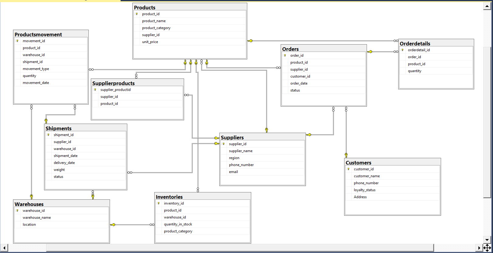

# SCM-Database-Design-and-Implementation-Project
A database project focused on the design, implementation, and testing of a Supply Chain Management (SCM) system.  Includes T-SQL scripts, ERD design decisions, and supporting screenshots from SQL Server Management Studio (SSMS) as part of the final report.

---

## 2. Database Design Decisions

### 2.1 Database Design and Decisions
The database is designed to efficiently manage suppliers, customers, orders, shipments, products, and their movement across warehouses. The primary design considerations include:

**Normalization and Adherence to 3rd Normal Form (3NF)**  
The design follows the principles of 3NF to eliminate redundancy, ensure data integrity, and optimize query performance. The database meets 3NF requirements as follows:

- **1st Normal Form (1NF):** Each table contains atomic (indivisible) values, ensuring that all columns contain only single values, with unique rows identified by primary keys.  
- **2nd Normal Form (2NF):** All non-key attributes are fully dependent on the primary key. For example, in the Orders table, `customer_id` is linked to a separate Customers table, avoiding partial dependency.  
- **3rd Normal Form (3NF):** The design removes transitive dependencies, ensuring that non-key attributes depend only on the primary key.  
  - Example: `supplier_id` in the Products table ensures that supplier details are stored in the Suppliers table rather than duplicating supplier information within the Products table.  
  - `customer_id` in the Orders table links to the Customers table rather than storing customer names directly in Orders, preventing redundancy.

### 2.2 Entity and Table Design
The database is designed to store and manage data related to suppliers, customers, products, orders, warehouses, inventories, shipments, and product movements. The design follows the relational database model with normalized tables to ensure data integrity and minimize redundancy.

**Tables Created:**
- **Suppliers:** Stores supplier details.  
- **Customers:** Maintains customer information and loyalty status.  
- **Orders:** Tracks customer orders and their statuses.  
- **OrderDetails:** Contains details of each order.  
- **Products:** Lists available products and their categories.  
- **Warehouses:** Manages warehouse locations.  
- **Inventories:** Tracks product stock levels in warehouses.  
- **Shipments:** Records product shipments from suppliers to warehouses.  
- **ProductMovement:** Monitors product movement between warehouses and suppliers.  
- **SupplierProducts:** Links suppliers with the products they supply.



---

## 3. Implementation Process

### 3.1 Creating Database and Tables
T-SQL was used to create the database schema. The primary and foreign keys were defined to establish relationships between tables.

**Example: Creating the Suppliers Table**
```sql
CREATE TABLE Suppliers (
    supplier_id INT PRIMARY KEY IDENTITY,
    supplier_name VARCHAR(30),
    region VARCHAR(30),
    phone_number VARCHAR(20),
    email VARCHAR(20)
);
```

**Example: Creating the Orders Table with Constraints**
```sql
CREATE TABLE Orders (
    order_id INT PRIMARY KEY IDENTITY,
    product_id INT REFERENCES Products(product_id),
    supplier_id INT REFERENCES Suppliers(supplier_id) ON DELETE CASCADE,
    customer_id INT REFERENCES Customers(customer_id),
    order_date DATETIME DEFAULT GETDATE(),
    status VARCHAR(10) CHECK (status IN ('Pending', 'Completed', 'Shipped', 'Cancelled'))
);
```

### 3.2 Data Insertion
Data was inserted into the tables using `INSERT INTO` statements.  
**Example:**
```sql
INSERT INTO Suppliers (supplier_name, region, phone_number, email) VALUES
('ElectroWorld', 'Asia', '+91-1234567890', 'electro@world.com'),
('FashionHub', 'Europe', '+44-9876543210', 'fashion@hub.com');
```

### 3.3 Foreign Key Constraints
Foreign keys ensure data consistency by enforcing relationships between tables.

```sql
CREATE TABLE Orderdetails(
    orderdetail_id INT PRIMARY KEY IDENTITY,
    order_id INT REFERENCES Orders(order_id) ON DELETE CASCADE,
    product_id INT REFERENCES Products(product_id),
    quantity INT CHECK (quantity > 0)
);
```

- `order_id INT REFERENCES Orders(order_id) ON DELETE CASCADE`: Ensures that deleting a row from Orders will delete related OrderDetails.  
- `product_id INT REFERENCES Products(product_id)`: Establishes relationship with Products table.  
- `PRIMARY KEY (orderdetail_id)`: Guarantees uniqueness and non-null values.  
- `IDENTITY`: Auto-generates unique `orderdetail_id`.  
- `CHECK (quantity > 0)`: Prevents invalid quantity values.

---
## 4. Testing Strategy

### 4.1 Data Integrity Testing
- Verified `NOT NULL` and `CHECK` constraints by attempting invalid data inserts.
- Test `CHECK` Constraint: Insert invalid `LoyaltyStatus` (should fail).  
- Test `NOT NULL` Constraint: Insert a row without `productID` and `warehouseID` (should fail).  

### 4.2 Query Execution Testing
- Executed `SELECT` queries to verify data retrieval.
- Used `JOIN` queries to validate table relationships.

**Example Query:**
```sql
SELECT c.customer_name, o.order_id, p.product_name, o.status
FROM Orders AS o
JOIN Customers AS c ON o.customer_id = c.customer_id
JOIN Products p ON o.product_id = p.product_id;
```

### 4.3 Referential Integrity Testing
- Checked cascading deletes by deleting a supplier and verifying dependent records were removed.

### 4.4 Performance Testing
- Indexed frequently queried columns to optimize search performance.
- Executed queries with large datasets to measure response times.

## 5. Conclusion
The database was designed following best practices in relational database management. The implementation ensured integrity through constraints and foreign keys. Testing confirmed proper functionality, data integrity, and performance optimization.

## 6. Screenshots
The following screenshots from SSMS are provided to visually support the explanations of key SQL operations performed. These include:

### 6.1. Selecting Data
- Retrieve product IDs and names from inventory using an `INNER JOIN` with Products.  
```sql
SELECT i.product_id, p.product_name
FROM Inventories AS i 
JOIN Products AS p ON p.product_id = i.product_id;
```
- Retrieve order IDs and customer names for completed orders using `INNER JOIN` with Customers.
```sql
SELECT o.order_id, c.customer_name 
FROM Orders AS o 
JOIN Customers AS c
ON o.customer_id = c.customer_id
WHERE status = 'Completed';
```    
- Retrieve distinct supplier names supplying Electronics products via `JOIN`s.
```sql
SELECT DISTINCT s.supplier_name, s.phone_number, s.email
FROM Suppliers AS s
JOIN Supplierproducts AS sp 
ON s.supplier_id = sp.supplier_id
JOIN Products AS p
ON sp.product_id = p.product_id
WHERE p.product_category = 'Electronics';
```   
- Retrieve product IDs and quantities for items with stock < 50 units.
```sql
SELECT product_id, quantity_in_stock
FROM Inventories
WHERE quantity_in_stock < 50;
```
- Retrieve shipment IDs and delivery dates for all shipments with `'Received'` status.
```sql
SELECT shipment_id, delivery_date
FROM Shipments
WHERE status = 'Received';
``` 

### 6.2. Filtering Data
- Retrieve the order IDs and customer names for orders placed between January 1, 2024, 
and March 31, 2024, with a total order value exceeding $1000.
```sql
SELECT o.order_id, c.customer_name, (od.quantity * p.unit_price) AS Total_Value
FROM Orders AS o
JOIN Customers AS c
ON o.customer_id = c.customer_id
JOIN Orderdetails AS od
ON od.product_id = o.product_id
JOIN Products AS p
ON od.product_id = p.product_id
WHERE o.order_date BETWEEN '2024-01-01' AND '2024-01-31' AND (od.quantity * p.unit_price) > 1000;
```  
- Retrieve Electronic products with stock levels below 20.
```sql
SELECT i.product_id, p.product_name
FROM Inventories AS i
JOIN Products AS p 
ON i.product_id = p.product_id
WHERE quantity_in_stock < 20 AND p.product_category = 'Electronics';
``` 
- Retrieve names of Asian suppliers providing Clothing products.
```sql
SELECT supplier_name, phone_number, email
FROM Suppliers AS s
JOIN Supplierproducts AS sp
ON s.supplier_id = sp.supplier_id
JOIN Products AS p
ON p.supplier_id = s.supplier_id
WHERE p.product_category = 'Clothing' AND s.region = 'Asia';
``` 
- Retrieve product IDs and quantities of shipped items > 1000kg.
```sql
SELECT pm.product_id, pm.quantity
FROM Productsmovement AS pm 
JOIN Shipments AS sh
ON pm.shipment_id = sh.shipment_id
WHERE weight > 1000 AND pm.movement_type = 'Shipped';
```

- Retrieve orders for 'Gold' loyalty customers with value > $500.
```sql
SELECT o.order_id, c.customer_name, (od.quantity * p.unit_price) AS Total_order_Value
FROM Orders AS o
JOIN Customers AS c
ON o.customer_id = c.customer_id
JOIN Orderdetails AS od 
ON od.product_id = o.product_id
JOIN Products AS p
ON p.product_id = od.product_id
WHERE c.loyalty_status = 'Gold' AND (od.quantity * p.unit_price) > 500;
```

### 6.3. Sorting Data
- Retrieve and sort received shipments by delivery date (ascending).
```sql
SELECT shipment_id, delivery_date
FROM Shipments
WHERE status = 'Received'
ORDER BY delivery_date;
``` 
- Retrieve alphabetically sorted product names and IDs.
```sql
SELECT i.product_id, p.product_name  
FROM Inventories AS i
JOIN Products AS p
ON i.product_id = p.product_id
ORDER BY p.product_name ASC;
``` 
- Retrieve alphabetically sorted supplier names and contact details.
```sql
SELECT supplier_name, phone_number, email 
FROM Suppliers
ORDER BY supplier_name ASC;
``` 
- Retrieve sorted customer names and their completed order IDs.
```sql
SELECT o.order_id, c.customer_name
FROM Orders AS o
JOIN Customers AS c
ON o.customer_id = c.customer_id
WHERE o.status = 'Completed'
ORDER BY c.customer_name ASC;
``` 
- Retrieve sorted product IDs and quantities.
```sql
SELECT product_id, quantity_in_stock AS quantities
FROM Inventories
WHERE quantity_in_stock < 50
ORDER BY quantities DESC;
```

### 6.4. Using DISTINCT
- Retrieve distinct product categories in inventory.
```sql
SELECT DISTINCT product_category AS Product_Categories
FROM Inventories;
```
- Retrieve distinct order IDs from Orders.
```sql
SELECT DISTINCT order_id
FROM Orders;
```
- Retrieve distinct supplier names.
```sql
SELECT DISTINCT supplier_name AS Supllier_Names
FROM Suppliers;
``` 
- Retrieve all distinct shipment IDs from Shipments.
```sql
SELECT DISTINCT shipment_id
FROM Shipments
WHERE status = 'Received';
```
- Retrieve all distinct customer names and order IDs.
```sql
SELECT DISTINCT c.customer_name, o.order_id
FROM Customers AS c
JOIN Orders AS o
ON c.customer_id = o.customer_id;
```
